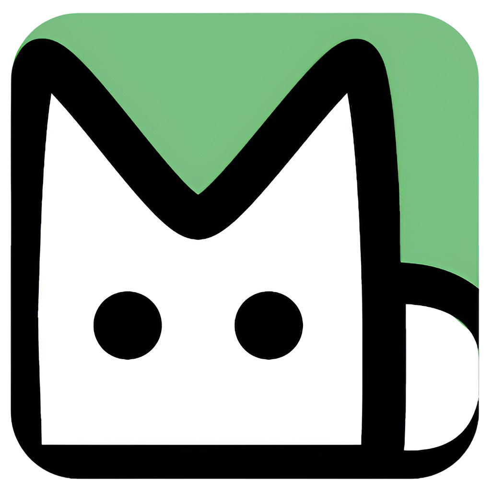
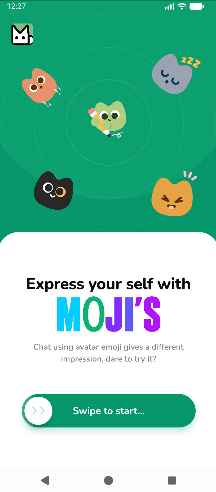
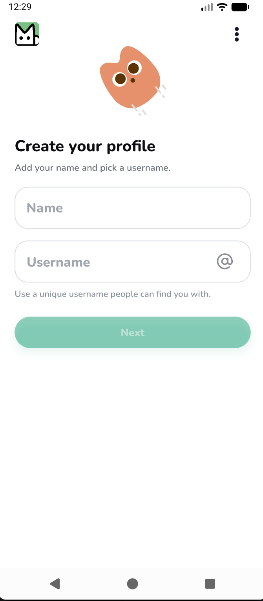
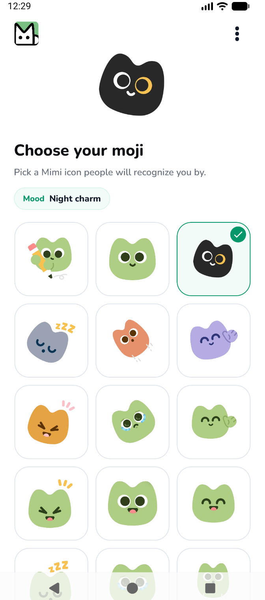
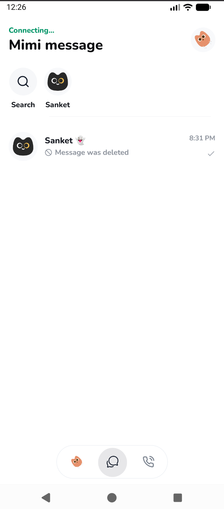
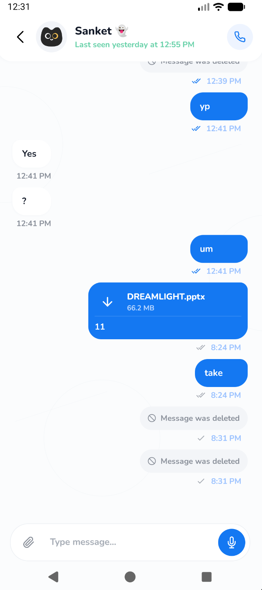
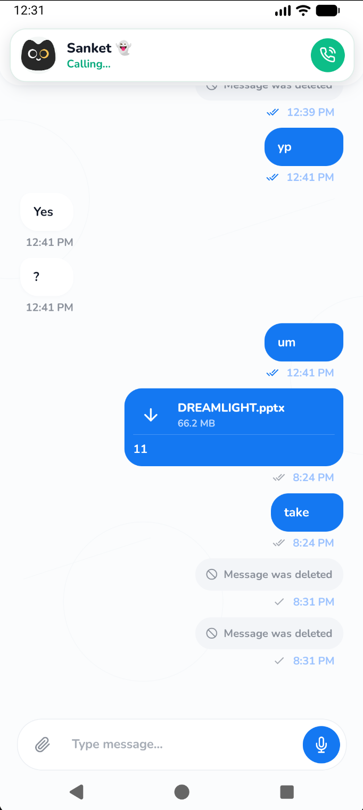

  

<h1 align="center">Mimi</h1>

  A simple place to talk, share, and stay close.
  Web version development will start after completion of application.

<a href="https://github.com/sanketpadhyal/Mimi-Project/releases/download/v0.1.0-alpha/mimi-early-access-v0.1.0.apk"><strong>Download Early Access</strong></a>
  &nbsp;&middot;&nbsp;
  <a href="../../releases">All Releases</a>
  &nbsp;&middot;&nbsp;
  <a href="../../issues">Report a Problem</a>

  
  
  

> [!IMPORTANT]
> Mimi is under active development. Early Access builds may contain bugs, unfinished screens, or changes that are not backward compatible. Please read the release notes before installing an update.

## About Mimi

Mimi is a one-to-one messaging app for everyday conversations. You can find people by username, send messages and files, record voice messages, and make voice calls from the same app.

Mimi also gives each person a **Moji** profile character. It keeps profiles friendly and easy to recognize without asking everyone to upload a personal photo.

Mimi includes **Personal Cloud**, a private chat with yourself for saving notes, links, photos, videos, documents, and other files. It appears with the rest of your chats when it has content, and it can also be opened from the dashboard Cloud shortcut.

The app is being built step by step. The first goal is a dependable mobile experience for chat, calls, notifications, profiles, privacy controls, and account settings.

## App Preview

  
  
  

  
  
  

## Download Mimi

The newest Early Access build is available on the [latest release page](../../releases/latest).

1. Open **Download Early Access**.
2. Read the release notes and known issues.
3. Download the app file listed under **Assets**.
4. Install it on a supported device.
5. Sign in with Google and finish your Mimi profile.

Early Access is meant for testing and feedback. It is not the final public release.

## What You Can Do

### Chat

- Start a private one-to-one chat by searching for a Mimi username.
- Message yourself in Personal Cloud to save notes, links, documents, media, and reminders.
- Send text, photos, videos, documents, and other files.
- Record and play voice messages.
- Send several photos or videos together.
- Reply to a message or swipe on it to reply quickly.
- Copy and edit your own text messages.
- Delete a message only for yourself or remove your own message for everyone.
- Open link previews and find mentioned Mimi users.
- See sent, delivered, and read states.
- See online, last-seen, typing, recording, and upload activity when privacy settings allow it.
- Pin, mute, search, and remove conversations.
- Search chats, message text, usernames, global people, and Personal Cloud from one search screen.
- Share text, photos, videos, documents, and other files from another Android app into Mimi.
- Open shared items directly in Mimi without waiting through the startup splash.
- Select a photo or document and add a caption only when you tap the message field.

### Voice Calls

- Make and receive one-to-one voice calls.
- Answer, decline, join, or return to a call from its notification.
- Mute the microphone or use the speaker during a call.
- Keep navigating Mimi while a call is active with reduced call-screen overhead.
- See recent, missed, declined, and completed calls.
- Remove call history for yourself or for both people.
- Choose who is allowed to call you.

### Notifications

- Receive alerts for new messages and incoming calls.
- Reply to a message or mark it as seen from the notification.
- Open the correct chat or call directly from an alert without replaying the startup splash.
- Keep an ongoing-call notification available while the call is active.
- Turn message alerts, call alerts, previews, and sounds on or off.
- Mute one conversation without changing alerts for every chat.

### Profile And Privacy

- Sign in with a Google account.
- Sign in faster with passkeys on supported devices.
- Choose a name and a unique `@username`.
- Pick one of Mimi's Moji profile characters.
- Add a short bio.
- Control who can see your bio, profile character, online status, and last seen.
- Limit calls to existing conversations, allow everyone, or block all calls.
- Block and unblock people.
- Review signed-in devices and log out other sessions.
- Lock Mimi with the same screen lock used by your phone. App lock asks again when the app is freshly reopened, not during normal in-app movement or an active call.

### Data And Storage

- Choose whether media downloads never, only on Wi-Fi, or on any connection.
- Save received media to the device photo library when wanted.
- Use less mobile data for media.
- Clear cached chats and downloads from the device.
- Continue sending after brief connection problems through local pending-message recovery.

## Your First Time In Mimi

1. Sign in with Google.
2. Add your name and choose a unique username.
3. Pick a Moji profile character.
4. Write a short bio and choose who can see it.
5. Choose who may call you.
6. Search for another Mimi user and start talking.

You can change these choices later from the **Profile** tab.

## Main App Areas

| Area | What it is for |
| --- | --- |
| Chats | Recent conversations, unread messages, pinned chats, search, and new chats |
| Chat room | Messages, attachments, voice notes, replies, links, mentions, and message controls |
| Personal Cloud | A private self-chat for saved messages, files, links, and notes |
| Calls | Recent voice calls and call history controls |
| Profile | Account details, privacy, notifications, storage, devices, help, and sign out |

## Privacy And Account Controls

Mimi uses Google sign-in and device sessions to identify an account. The app stores the active session in protected device storage and lets you end other signed-in sessions from the Devices page.

Passkeys are available on supported Android devices and are configured for Mimi's Android app identity. Device app lock uses the phone's own secure unlock screen, so Mimi does not learn or store your device PIN, password, pattern, fingerprint, or face unlock data.

Privacy is controlled separately for your bio, profile character, last seen, online activity, and incoming calls. Blocking a person stops direct interaction between the two accounts.

Mimi is still in Early Access and has not been presented as a finished, independently audited security product. Do not use an Early Access build for highly sensitive or emergency communication.

## How Mimi Works

Mimi uses a mobile app connected to its own cloud service.

- The app handles profiles, conversations, media, notifications, and calls.
- The backend manages accounts, sessions, passkeys, user search, privacy rules, Personal Cloud chats, message states, blocks, and call history.
- Live chat updates, presence, typing activity, and call signalling use a real-time connection.
- Voice calls send audio directly through WebRTC where possible, with configured relay support when needed.
- MongoDB stores account, chat, message, session, and call records.
- Firebase provides Google authentication support, push delivery, and media storage.

## Current Status

| Part | Status |
| --- | --- |
| Mobile app | Under active development |
| Early Access download | Available in [GitHub Releases](../../releases) |
| One-to-one chat | Available for testing |
| Personal Cloud | Available for testing |
| Media and voice messages | Available for testing |
| Voice calls | Available for testing |
| Notifications | Available for testing |
| Passkeys and app lock | Available for testing on supported devices |
| Web version | Planned after the mobile app and its connected services are ready |

Features may be added, removed, renamed, or rebuilt during Early Access.

## What Comes Next

Work is focused on the app first:

- Make chat delivery and media sharing more dependable.
- Improve voice call quality and recovery on weak networks.
- Polish notifications, privacy controls, device sessions, and data use.
- Improve accessibility, performance, and support across more devices.
- Fix issues reported by Early Access testers.

A web version of Mimi is planned. Web development will start after the core mobile app and its connected services are stable enough to form one complete experience.

## Early Access Feedback

If something breaks, please [open an issue](../../issues) and include:

- Mimi version from the release page.
- Device model and operating system version.
- What you were trying to do.
- What happened instead.
- Steps that make the problem happen again.
- A screenshot or short recording, if it does not expose private information.

Please remove names, email addresses, message content, access tokens, and other personal information before posting publicly.

## About This Repository

This public repository is the home for Mimi information, release notes, downloads, and feedback. It does not contain the private application or backend source code.

Use the [Releases page](../../releases) to get official Early Access builds. Do not download Mimi from unknown mirrors or third-party links.
